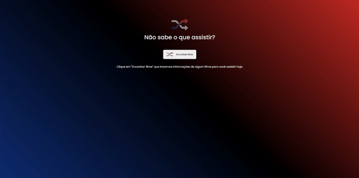

# Film Selector

This is a webpage that consumes "The movie DB" API's. 

   

### Funcionality

The page will recommend the user a movie to watch if the button is pressed.

Currently, the page is not hosted, but you can clone this repository and run it, by just running "npm install" and then "npm run dev".